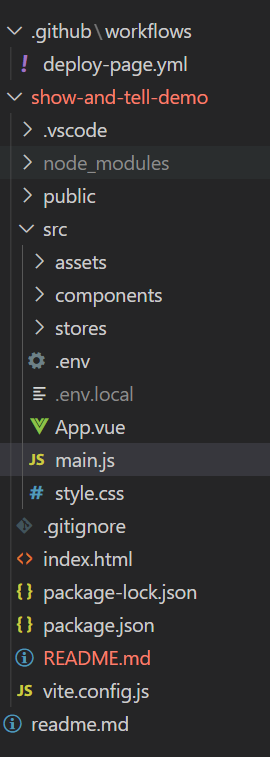
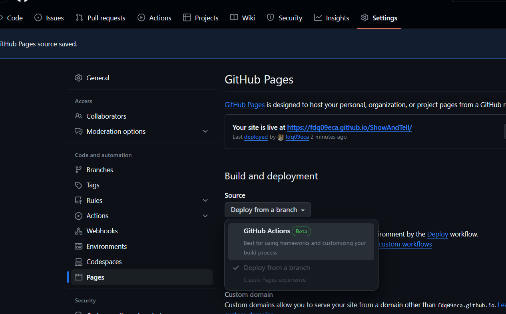

# [`Vite`][vite] + [`Vue2`][vue2] + [`Pinia`][pinia] + [`Esri ArcGIS API for JavaScript`][esriJs] template

This template should help get you started developing with [`Vue2`][vue2] with [`Esri ArcGIS API`][esriJs] in [`Vite`][vite].
The template uses [`Vue2`][vue2] option API and [`Pinia`][pinia] for state management.

[vue2]: https://v2.vuejs.org/
[pinia]: https://pinia.vuejs.org/
[vite]: https://vitejs.dev/
[esriJs]: https://developers.arcgis.com/javascript/latest/

## How to run

> **MAKE SURE YOU [SET YOUR ESRI API KEY](https://developers.arcgis.com/documentation/mapping-apis-and-services/security/tutorials/create-and-manage-an-api-key/) IN `.env.local`** (create one if you do not)

you should have the following folder structure


```bash
npm i
npm run dev
```

## How to build

```bash
npm run build
npm run preview
```

## How to deploy to GitHub page

- update [`deploy-page.yml`](../.github/workflows/deploy-page.yml) for the following fields
  - `working-directory: ./<your-gui-project-folder>/`
  - `cache-dependency-path: './<your-gui-project-folder>/package-lock.json'`
  - `path: './<your-gui-project-folder>/dist'`
- update [`vite.config.js](./vite.config.js) base
  - `base: "/<your-repo-name>/"`
- go to your `github repo` -> `Setting` -> `Pages` -> `Build and Deployment` -> `Source` -> `GitHubAction`


